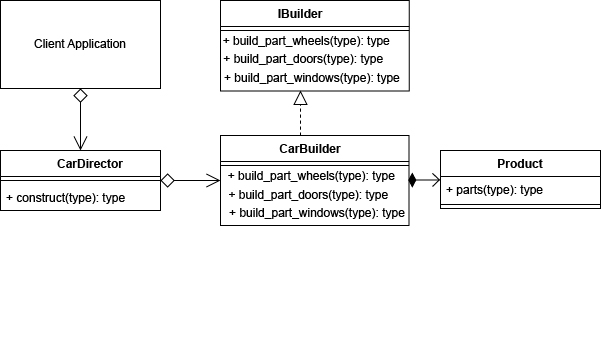

# Шаблони проектування. Породжувальні шаблони

## Мета

Освоїти роботу з породжувальними шаблонами в Python3.

## Породжувальні шаблони

 Породжувальні шаблони, як випливає з назви, мають справу зі створенням класів або об'єктів. Вони служать для абстрагування від специфіки класів, щоб ми були менш залежні від їх точної реалізації, або щоб нам не доводилося мати справу зі складною конструкцією щоразу, коли вони нам потрібні, або щоб ми забезпечували деякі спеціальні властивості при створення екземплярів. Вони дуже корисні для зниження рівня залежності між класами і управління взаємодією користувача з ними. Породжуючі патерни піклуються про гнучке створення об’єктів без внесення в програму зайвих залежностей.

## Шаблон будівельник (Builder)

Будівельник — це породжувальний патерн проектування, що дає змогу створювати складні об’єкти крок за кроком. Будівельник дає можливість використовувати один і той самий код будівництва для отримання різних відображень об’єктів.

## Приклад коду

```python
from abc import ABCMeta, abstractmethod


class IBuilder():
    "The Builder Interface"
    @staticmethod
    @abstractmethod
    def build_part_wheels():
        "Build part wheels"

    @staticmethod
    @abstractmethod
    def build_part_doors():
        "Build part doors"

    @staticmethod
    @abstractmethod
    def build_part_windows():
        "Build part windows"

    @staticmethod
    @abstractmethod
    def get_result():
        "Return the final product"


class CarBuilder(IBuilder):
    "CarBuilder"

    def __init__(self):
        self.product = Product()

    def build_part_wheels(self):
        self.product.parts.append('wheels')
        return self

    def build_part_doors(self):
        self.product.parts.append('doors')
        return self

    def build_part_windows(self):
        self.product.parts.append('windows')
        return self

    def get_result(self):
        return self.product


class Product():
    "The Product"

    def __init__(self):
        self.parts = []


class CarDirector:
    "The Director, building a complex representation."

    @staticmethod
    def construct():
        "Constructs and returns the final product"
        return CarBuilder()\
            .build_part_wheels()\
            .build_part_doors()\
            .build_part_windows()\
            .get_result()


# The Client
Car1 = CarDirector.construct()
print(Car1.parts)

```

## Вивід
>['wheels', 'doors', 'windows']

## UML-діаграма 



## Висновок

Патерн Будівельник дозволяє збирати об’єкти покроково, викликаючи тільки ті кроки, які вам потрібні. Отже, більше не потрібно намагатися «запхати» до конструктора всі можливі опції продукту. Також його можна застосувати, якщо створення кількох відображень об’єкта складається з однакових етапів, які відрізняються деталями.
#### Переваги
* Дозволяє створювати продукти покроково.
* Дозволяє використовувати один і той самий код для створення різноманітних продуктів.
* Ізолює складний код конструювання продукту від його головної бізнес-логіки.
#### Недоліки
* Ускладнює код програми за рахунок додаткових класів.
* Клієнт буде прив’язаний до конкретних класів будівельників, тому що в інтерфейсі будівельника може не бути методу отримання результату.
